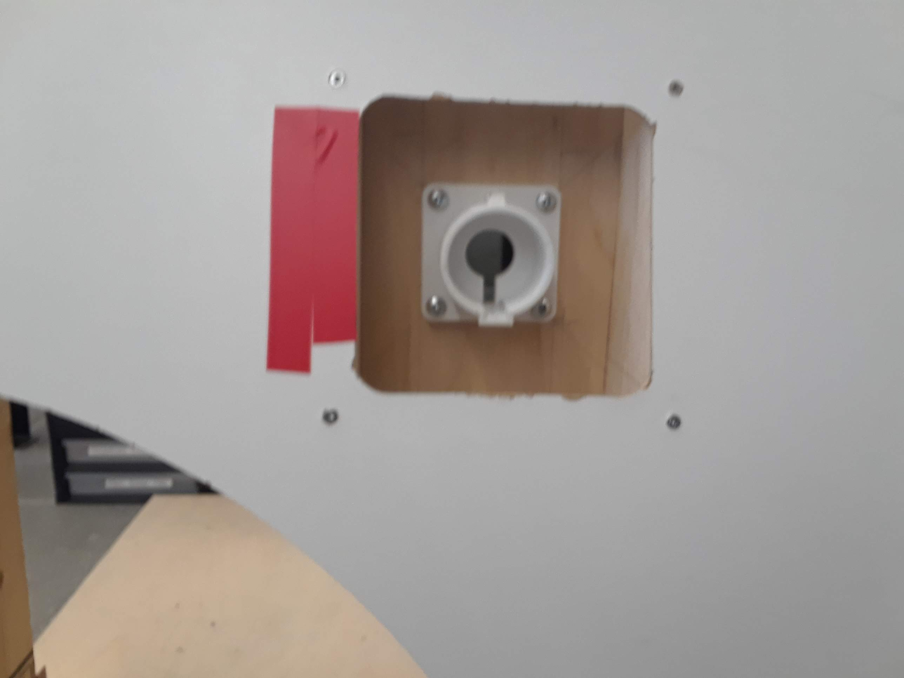
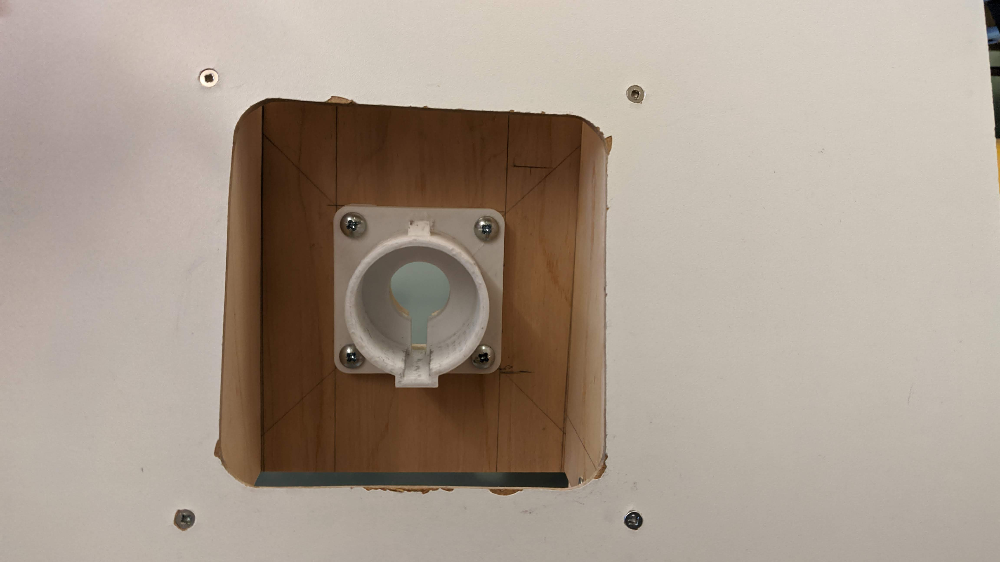
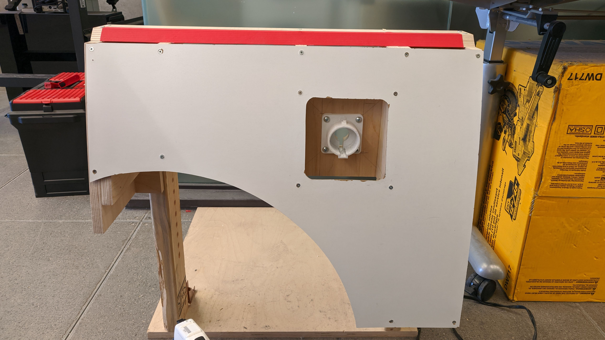

# esc204_charging_port_finder
## Purpose
Identify the charging port of model car using computer vision and the OpenCV2 library. This project was done for U of T Engineering Science's Praxis 3 project.

## Instructions for Use
Run charging_port_finder.py.

Press "q" to close window and quit program executable.

## Limitations
The computer vision does not work in poorly lit conditions or when only part of the charging port is visible in the screen.

Future changes would ensure that once the charging port is found, it will not jump across the screen suddenly (i.e. the computer will have awareness of the previous position of the charging port). Right now, it analyzes each frame completely individually.

## Additional Info
The .jpg files are for testing. The main function is found in charging_port_finder.py. Some modification is required to get the executable to use the images rather than the video camera. This involves changing which function is called in the main function.

#### *(Above) First test image. Zoomed in picture of the charging port with 'debris'.*

#### *(Above) Second test image. Clean picture of the charging port.*

#### *(Above) Third test image. Wholistic view of the charging port and surroundings. The background offers distractions for the computer vision.*
